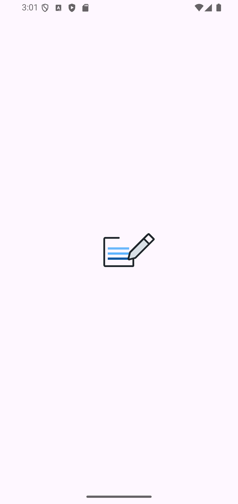
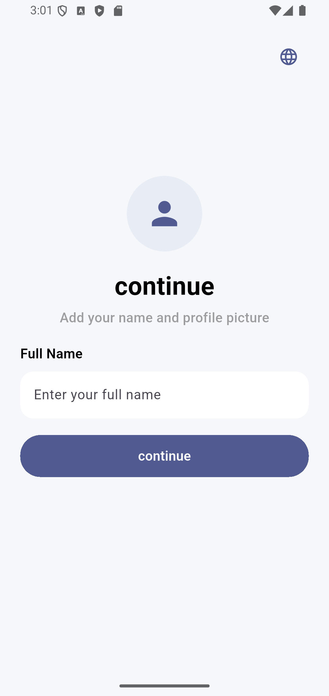
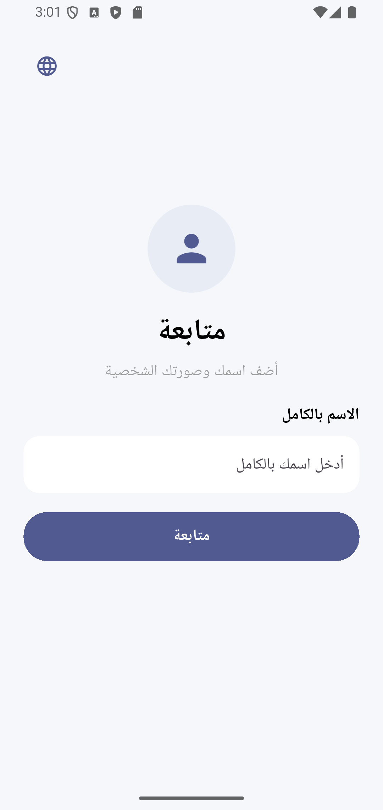
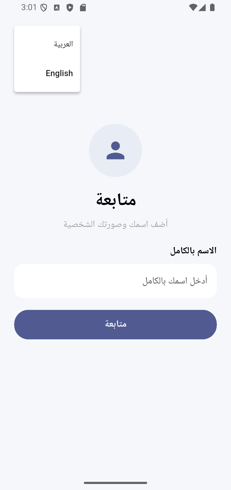

# 📝 To-Do App

A simple and modern To-Do application built with Flutter and Dart.

This project helps users organize their daily tasks through a clean, user-friendly interface with multilingual support.

## 📱 App Screens
<p align="center">
  
  
  
  
</p>


<details>
<summary>🌍 Generate Localization Keys</summary>

```bash
dart run easy_localization:generate --source-dir ./assets/translations -f keys -o locale_keys.g.dart -O lib/gen
